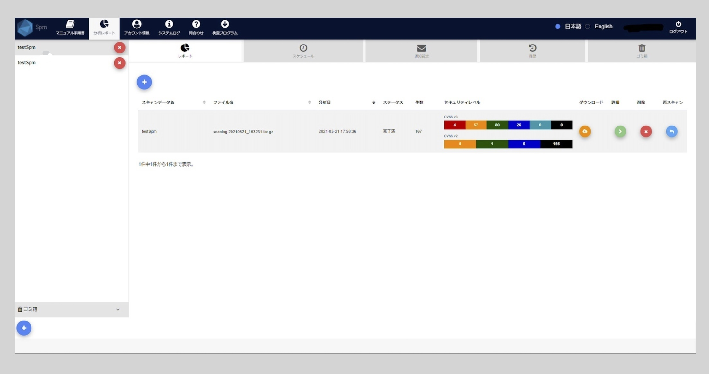
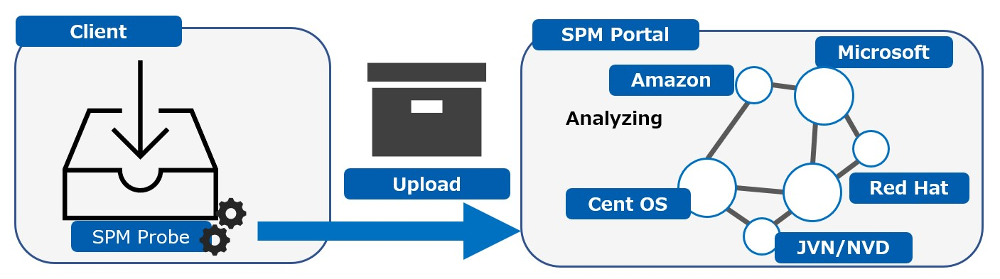
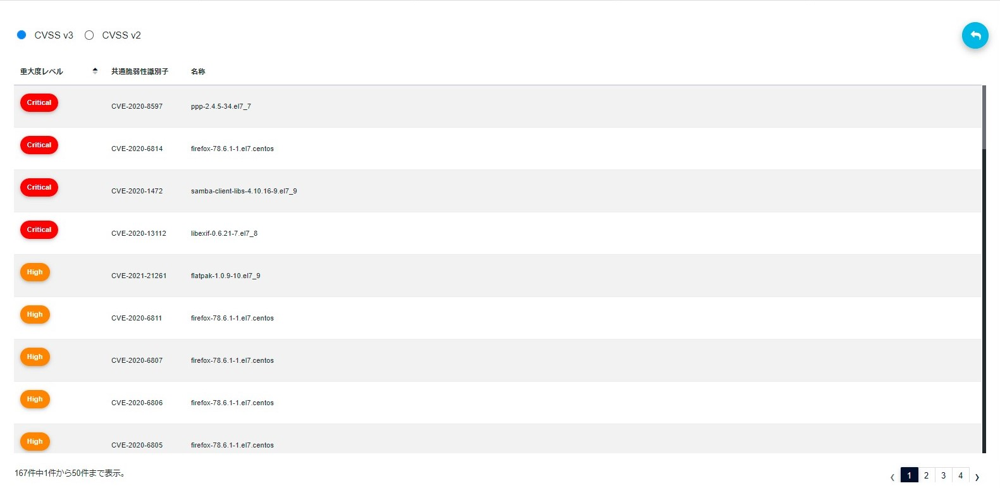

<!--  LOGO -->

    

<!-- TABLE OF CONTENTS -->

  
目次

  <ol>
    <li>SPMとは</li>
    <li>
      SPMの特徴
      <ul>
        <li>サポートOS</li>
        <li>脆弱性情報の収集元</li>
      </ul>
    </li>
    <li>使い方</li>
    <li>脆弱性レポート</li>
    <li>ライセンス</li>
    <li>我々について</li>
  </ol>

<!-- SPM Abstract -->

## SPMとは(https://solution.belue-c.jp/)
**「SPM（セキュア・パッケージ・マネジメント）」は、サーバのOSやミドルウェアの設定不備、セキュリティパッチの適用状況、システム情報、サービス情報、インストールしているパッケージ・ソフトウェア等に潜む脆弱性を検出します。**

SPM Probeはインストールされているパッケージ情報、システム情報等を収集する検査スクリプトです。 

    

<!-- SPM Features -->

## SPMの特徴
**SPMは安全・簡単にシステムの脆弱性を解析します。**

SPM ProbeはOSの標準コマンドを利用し、インストールされているパッケージ情報、システム情報等を収集する検査スクリプトです。

 * バイナリファイルのインストール作業はありません。(システムをクリーンな状態に保ちます。)
 * 常駐型でもありません。(不要になったらいつでもSPM Probeを削除して頂いて構いません。)
 * システム・ネットワークトラフィックを圧迫しません。
 * SPM Probeはシステムの設定を変更しません。(既存の設定情報をテキストファイルに書き出すだけです。)

    

<!-- Support -->

### サポートOS
**SPMではWindows/Linux系のOSに対応しています。**

 * Windows Server2016 ※1
 * Windows Server2019 ※1
 * Redhat 6/7/8 ※2
 * CentOS 6/7 ※2
 * AmazonLinux ※2
 * AmazonLinux2 ※2

※1: Server Core以外が対応 
※2: 標準カーネルのみ対応

<!-- Resource -->

### 脆弱性情報の収集元
**主に以下ベンダーまたは組織から公開されている脆弱性を日々収集し、最新の脆弱性情報をレポートします。**

  * [Microsoft](https://www.microsoft.com/ja-jp)
  * [Redhat](https://www.redhat.com/en/global/japan)
  * [CentOS](https://www.centos.org/)
  * [Amazon](https://www.aboutamazon.com/)
  * [JVN/NVD](https://jvndb.jvn.jp/index.html)

<!-- Usage  -->

## 使い方
**脆弱性レポート出力までの流れ**

Step1. SPM Probeのダウンロード 
システム上の任意のディレクトリへSPM Probeをコピーします。

Step2. SPM Probeの実行 
コピーしたSPM Probeを管理者権限で実行します。実行後、圧縮ファイルが出力されます。

Step3. SPMポータルサイトへ出力ファイルのアップロード 
「Step2」で生成されたファイルを以下のSPMポータルサイトへアップロードします。 
◆SPMポータルサイト (https://spm.belue-c.jp) 

Step4. 脆弱性レポートのダウンロード 
ポータルサイトから脆弱性レポートをダウンロードします。

<!-- Report -->

## 脆弱性レポート
**SPM専用ポータルサイトから脆弱性の詳細レポート(エクセル形式)をダウンロードできます。**

 * システムに内在する脆弱性の件数と各リスクレベル(CVSS Score)
 * 検出された脆弱性の詳細情報(CVE/脆弱性の概要等/各種ベンダ情報)
 * インストールされているパッケージとバグフィックス版パッケージ情報

    

<!-- LICENSE -->

## ライセンス
本ソフトウェアはGNU General Public License version 2.0(GPL v2.0)ライセンスに従います。詳細は[ライセンス](LICENSE)をご参照ください。

<!-- CONTACT -->

## 我々について
SPMポータルサイト
https://spm.belue-c.jp

弊社ウェブサイト
https://belue-c.jp

お問い合わせ先
https://belue-c.jp/contact
