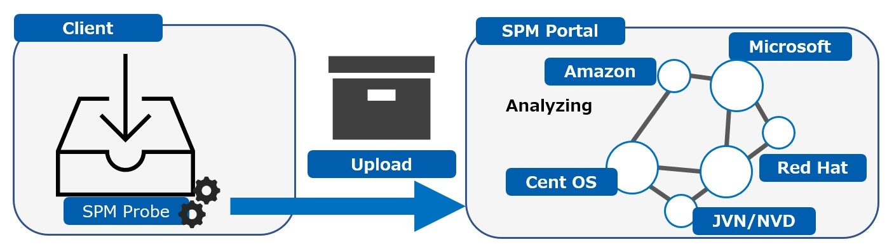
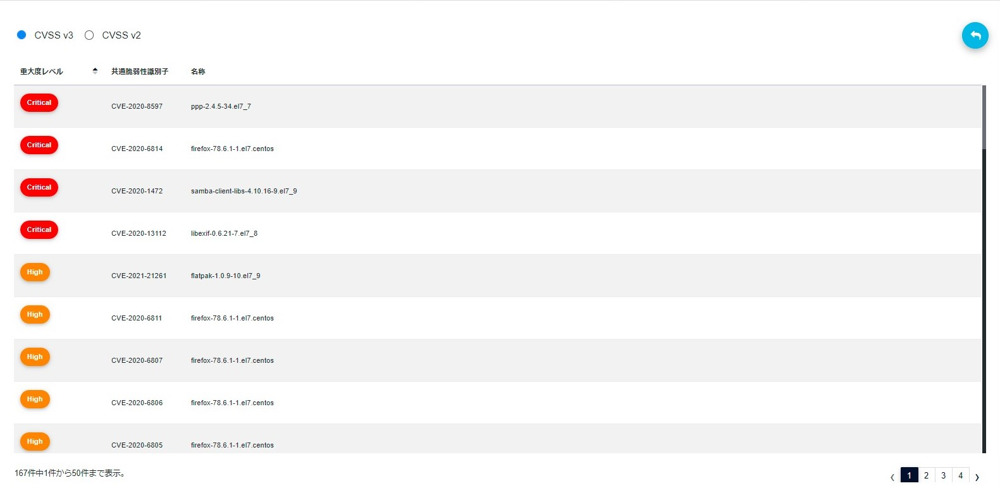

<!--
*** Thank you for read and have interest about this project.
*** We know that this SPM and Prove are able to create better security life for your office.
*** Sincerely.
*** Team Belue creative
-->

<!--  LOGO -->

    

<!-- TABLE OF CONTENTS -->

  
Table of Contents

  <ol>
    <li>
      SPM Abstract
    </li>
    <li>
      SPM Features
      <ul>
        <li>Support</li>
        <li>Resource</li>
      </ul>
    </li>
    <li>Usage</li>
    <li>SPM vulnerability report</li>
    <li>License</li>
    <li>About us</li>
  </ol>

<!-- SPM Abstract -->

## SPM Abstract (https://solution.belue-c.jp/)
**SPM (Secure Package Management) detects vulnerabilities in server OS and inadequate middleware settings, applicable security patch, system information, service information, installed package software, etc.**

SPM Probe is an inspection script that collects installed package information and system information. 

    

<!-- SPM Features -->

## SPM Features
**SPM analyzes system vulnerabilities safely and easily.**

SPM Probe is an inspection script that executes system’s default commands.

 * General requirements: SPM Probe is simple script file and does not pollute your system. You can delete SPM Probe anytime.
 * Fast scan: Scanning without a large amount of system resources and network traffic.
 * System environment: No particular settings. No additional system configurations. No changing existing files.

    

<!-- Support -->

### Support 
**SPM supports Windows/Linux OS listed below**

 * Windows Server2016 \*1
 * Windows Server2019 \*1
 * Redhat 6/7/8 \*2
 * CentOS 6/7 \*2
 * AmazonLinux \*2
 * AmazonLinux2 \*2

\*1: Except for Server Core 
\*2: Except for non-standard linux kernel

<!-- Resource -->

### Resource
**SPM collects vulnerability information from major vendor listed below on a daily basis and report latest vulnerabilities.**

  * [Microsoft](https://www.microsoft.com/ja-jp)
  * [Redhat](https://www.redhat.com/en/global/japan)
  * [CentOS](https://www.centos.org/)
  * [Amazon](https://www.aboutamazon.com/)
  * [JVN/NVD](https://jvndb.jvn.jp/index.html)

<!-- Usage  -->

## Usage
**Flow to output vulnerability report**

Step1. Download SPM Probe 
Copy SPM Probe on your target system.

Step2. Run SPM Probe 
Run SPM Probe as administrator privileges. After execution, the compressed file will be output.
    
Step3. Upload output file to SPM portal site 
Upload the created file in Step2 to the following SPM Portal Site. 
SPM Portal Site: https://spm.belue-c.jp

Step4. Download the vulnerability report 
Download the vulnerability report from the SPM Portal Site.

<!-- Report -->

## Vulnerability report
**You can download a detailed report(Excel Format) of the vulnerability from the SPM portal site.**

 * Number of vulnerabilities inherent in the system and each risk level (CVSS Score)
 * Details of detected vulnerabilities (CVE/Summary of vulnerabilities, etc./Various vendor information)
 * Installed packages and bug fix version package information

    

<!-- LICENSE -->

## License
The source code is licensed the GNU General Public License version 2.0 (GPL v2.0) License, see [License](LICENSE).

<!-- CONTACT -->

## About us
SPM Portal site
https://spm.belue-c.jp

Our company’s website
https://belue-c.jp/en

Contact
https://solution.belue-c.jp/en/contact